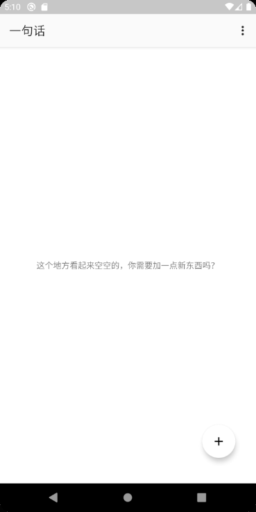
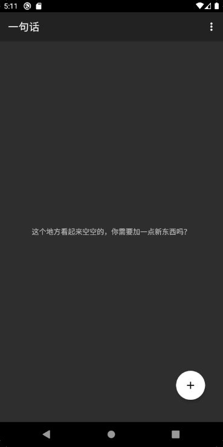
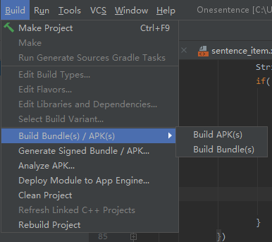

# 一句话

> 一句话，或许可以带给你极大的动力

**项目仍在开发中** 

# 简介
一句话，允许你添加句子，并且在主界面上展示这句话

# 开发目的
劳累的时候，忙的时候，压力大的时候，心情非常糟糕 
如果这时候能有一句话，能振奋自己，让自己不再迷茫，并且继续前行 
这种感觉是好的

# 下载
[Github Actions](https://github.com/KenMizz/Onesentence/actions) 
**正式的下载方式将会在本项目完成后推出**

# 自行打包
先clone本仓库 
``
git clone https://github.com/KenMizz/OneSentence
``
### 使用gradle
在Onesentence目录下，打开命令行，执行 
``
./gradlew assembleDebug
``
等待完成后，你会在目录下的``app/build/outputs/apk/``得到``app-debug.apk``
### 使用Android Studio
通过Android Studio打开本仓库，然后找到在Android Studio找到Build，选择apk选项 
 
等待完成后，在目录下的``app/build/outputs/apk/``得到``app-debug.apk``
